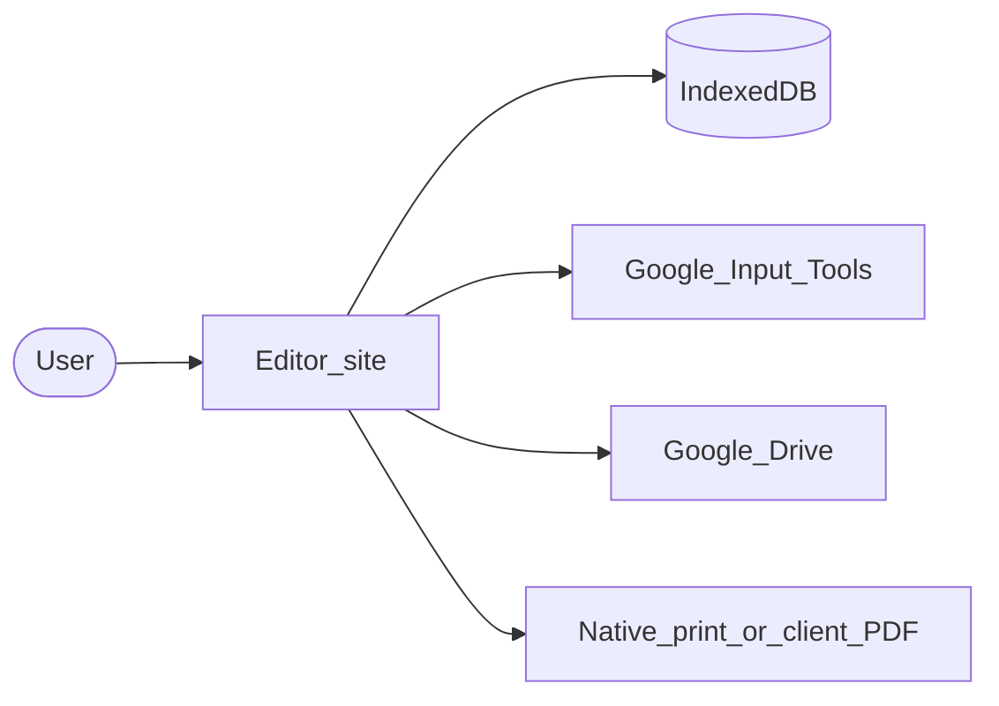
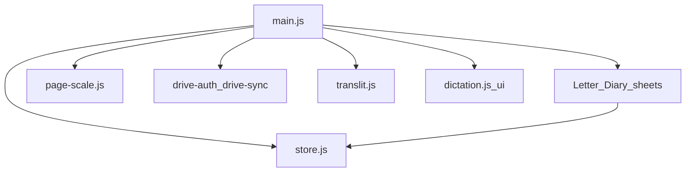

# Architecture

Bihar Police Notebook is a **static website** (the editor). There is no application server that stores your notes. Documents live in the browser (IndexedDB). Optional backup copies them into **your** Google Drive when you choose to sync.

**Live editor:** [https://bpdiary.arverma.dev/](https://bpdiary.arverma.dev/) (`bpdiary` is the domain alias for Bihar Police Notebook.)

## High-level system

| Piece | Role |
|-------|------|
| [Editor site](components/editor-shell.md) | UI: header, History, Letter/Diary pages, overlays |
| [IndexedDB](components/storage.md) | Local autosave on this device |
| [Google Input Tools](components/typing.md) | Hinglish → Hindi suggestions (network; desktop/tablet) |
| [Google Drive](components/drive-backup.md) | Manual backup / restore into your Drive folder |
| [Print / PDF](components/templates.md) | Shared A4 print clone → native print (desktop) or client PDF (iOS/iPadOS) |

## Editor internals (modules)

| Module area | Files | Detail page |
|-------------|-------|-------------|
| Shell / History / save | `editor/js/main.js` | [Editor shell](components/editor-shell.md) |
| Letter / Diary / print | `paged-sheet.js`, `diary-sheet.js`, `print-clone.js`, `pdf-export.js`, `client-pdf.js` | [Templates](components/templates.md) |
| Screen scale | `page-scale.js` | [Page preview](components/page-preview.md) |
| Local DB | `store.js` | [Storage](components/storage.md) |
| Drive | `drive-config.js`, `drive-auth.js`, `drive-sync.js` | [Drive backup](components/drive-backup.md) |
| Typing | `translit.js` | [Typing](components/typing.md) |
| Voice | `dictation.js`, `dictation-ui.js` | [Dictation](components/dictation.md) |
| Prefs | `prefs.js` | Used by Drive + dictation |
| Hosting | `.github/workflows/pages.yml` | [Deploy](components/deploy.md) |

## Phone vs computer

Behavior changes at **768px** width. See [Desktop vs mobile](desktop-vs-mobile.md).

## Testing

| Layer | Location | Command |
|-------|----------|---------|
| Unit (Vitest) | `editor/js/*.test.js` | `npm test` |
| E2E (Playwright) | `tests/*.spec.js` | `npm run test:e2e` |

See [tests/README.md](../tests/README.md).

## Important constants

| Item | Value |
|------|--------|
| Live origin | `https://bpdiary.arverma.dev` |
| Drive folder | `Bihar Police Notebook Backup — do not delete` |
| Drive scope | `drive.file` (files the app creates) |
| IndexedDB (docs) | `bp-writing-tool` |
| IndexedDB (auth) | `bp-writing-tool-auth` |
| Mobile breakpoint | `max-width: 768px` |
| Autosave debounce | 600ms |
