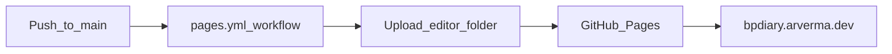

# Deploy and local preview

The editor is static files under `editor/`. GitHub Actions publishes that folder to GitHub Pages.

## Publish flow



Workflow: `.github/workflows/pages.yml` (triggers on changes under `editor/**`).

## Local preview

```bash
make serve
# open http://127.0.0.1:8080/   (PORT=3000 to override)
```

Equivalent: `cd editor && python3 -m http.server 8080`. See the Makefile for `install`, `test`, and `test-e2e`.

No Node build or Python backend for the app itself.

## OAuth origins (Drive)

Add authorized JavaScript origins for production (`https://bpdiary.arverma.dev`) and any local preview URL you use with Drive login. Client ID: `editor/js/drive-config.js`.

See: [Drive backup](drive-backup.md).
