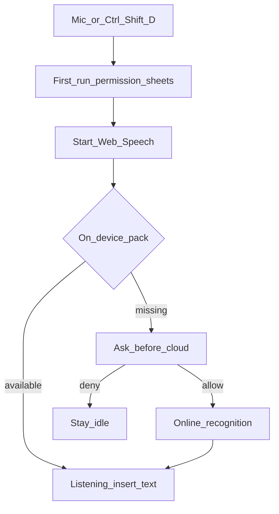

# Voice dictation (बोलकर लिखें)

In-app microphone for desktop and tablet. On phones (**≤768px**) the FAB is hidden — use the keyboard’s microphone instead.

Modules: `editor/js/dictation.js` (engine), `dictation-ui.js` (FAB / sheets).

## Flow

## Behavior notes

- Prefers **on-device** recognition in Chrome when the language pack is installed.
- Cloud path asks for consent first; the app does not store audio.
- FAB is draggable; Esc ends an active session (desktop).
- Mobile: CSS + `syncFabVisibility()` keep the control hidden and stop the engine on resize into mobile.

See: [Typing](typing.md), [Desktop vs mobile](../desktop-vs-mobile.md).
