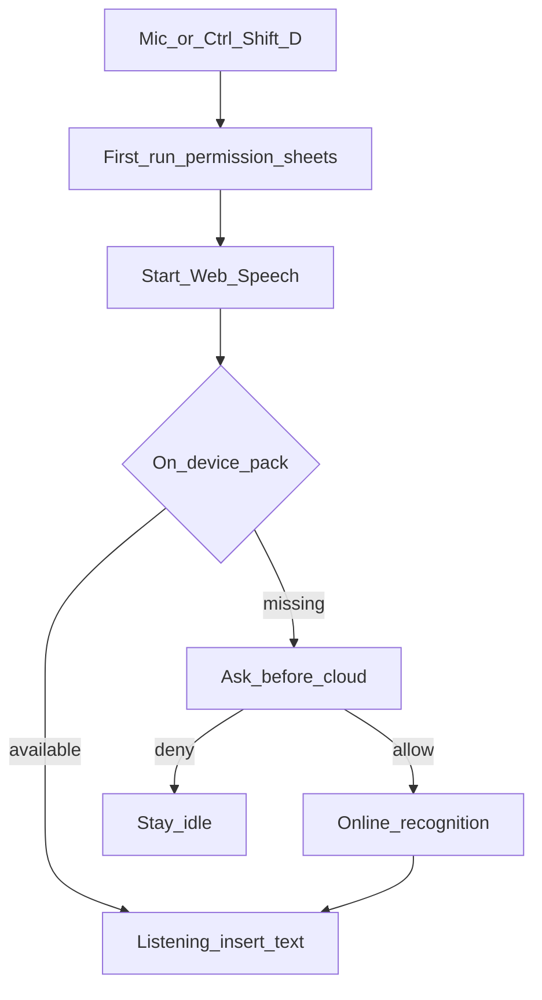

# Voice dictation (बोलकर लिखें)

In-app microphone for desktop and tablet, at the right end of the format toolbar in the top bar. On phones (**≤768px**) it is hidden — use the keyboard’s microphone instead.

Modules: `editor/js/dictation.js` (engine), `dictation-ui.js` (toolbar mic / sheets).

## Flow

```mermaid
flowchart TD
  tap[Mic_or_Ctrl_Shift_D]
  onboard[First_run_permission_sheets]
  start[Start_Web_Speech]
  device{On_device_pack}
  listen[Listening_insert_text]
  ask[Ask_before_cloud]
  cloud[Online_recognition]

  tap --> onboard
  onboard --> start
  start --> device
  device -->|available| listen
  device -->|missing| ask
  ask -->|allow| cloud
  cloud --> listen
  ask -->|deny| stop[Stay_idle]
```

## Behavior notes

- Prefers **on-device** recognition in Chrome when the language pack is installed.
- Cloud path asks for consent first; the app does not store audio.
- The mic sits in the toolbar (language chip, mic, and a stop button while a session is active); Esc ends an active session (desktop).
- Mobile: `syncFabVisibility()` keeps the control hidden and stop the engine on resize into mobile.

See: [Typing](typing.md), [Desktop vs mobile](../desktop-vs-mobile.md).
