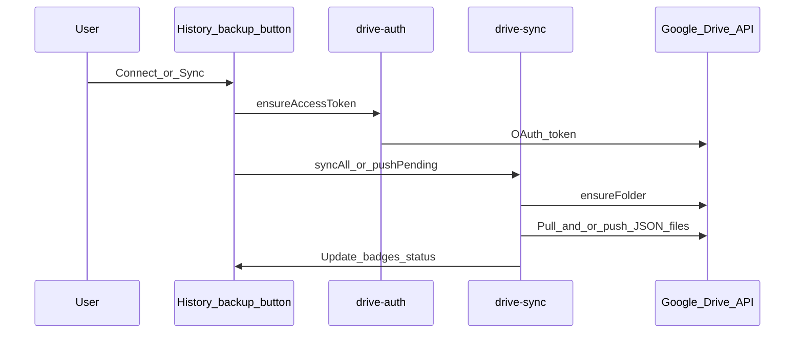

# Google Drive backup

Optional, **manual** sync. Nothing uploads until the user uses the backup control in History.

Folder created in My Drive: **`Bihar Police Notebook Backup — do not delete`**.

Scope: `https://www.googleapis.com/auth/drive.file` (files/folders this app creates).

## Modules

| File | Role |
|------|------|
| `drive-config.js` | Client ID, scope, folder name, API bases |
| `drive-auth.js` | Google Identity Services token; short-lived token cache in IndexedDB `bp-writing-tool-auth` |
| `drive-sync.js` | Ensure folder, push/pull/merge JSON per document UUID |

## Menu actions

| Action | Behavior |
|--------|----------|
| **Sync all** | Pull from Drive into local, then push dirty/new local docs to Drive |
| **Sync new** | Push only dirty/new local docs to Drive (no pull) |
| **Disconnect** | Revokes access in this browser; does not delete the Drive folder |

If the backup folder was deleted, the next sync recreates it and re-uploads local docs (stale Drive file ids are cleared).

## Sync sequence (happy path)

## File layout on Drive

- One folder (name above).
- One JSON file per document: `{uuid}.json`, matched with `appProperties.uuid`.
- Disconnect revokes access in this browser; it does **not** delete the Drive folder.

Maintainer note: OAuth Web client ID is in `drive-config.js`. Add authorized JavaScript origins for production and local preview; do not commit a client secret.

See: [Storage](storage.md), [Architecture](../architecture.md).
