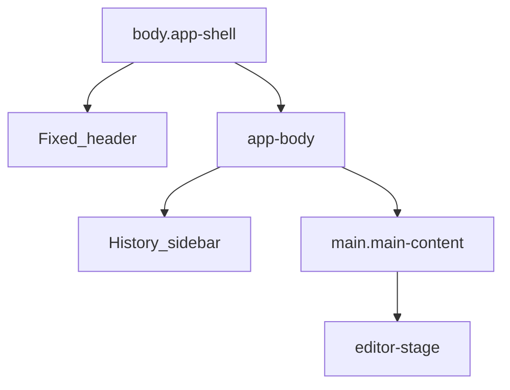
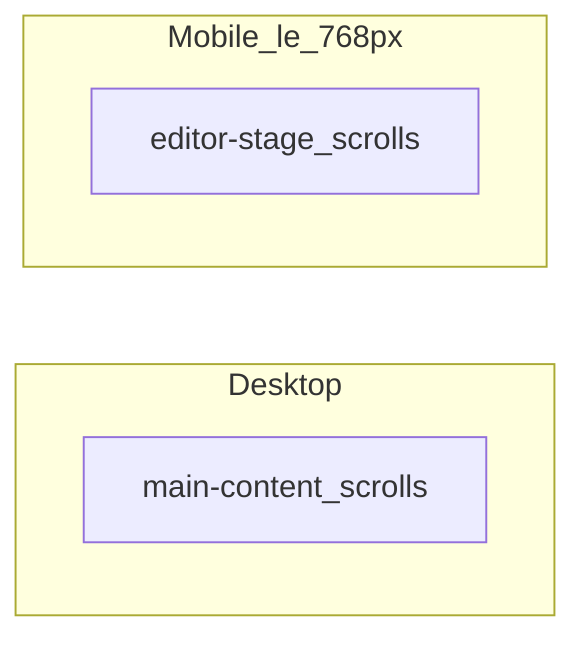

# Editor shell

The editor UI is a fixed app chrome around the A4 page preview. Markup lives in `editor/index.html`; layout tokens and shell CSS are in `editor/css/tokens.css`, `layout-shell.css`, `header-responsive.css`.

## Layout blocks

| Region | Responsibility |
|--------|----------------|
| Header | History toggle, brand, document name, Letter/Diary, PDF (Hinglish control on wider screens) |
| History sidebar | Document list, Drive backup icon, New document |
| `main-content` | Desktop vertical scrollport; padding for fixed header |
| `editor-stage` | Page preview; on mobile also the scroll / pinch viewport |

Orchestration: `editor/js/main.js` (sidebar toggle, template switch, autosave hooks, chrome height).

## History behavior

- Opens/closes only via the panel button (or Ctrl/Cmd+H / B) — not by outside click.
- On wide screens (≥1025px), opening History nudges the workspace slightly; on smaller screens it is an overlay drawer.
- Documents are grouped by **date created**; older day groups start collapsed. Each row shows last-updated time.
- Drive backup menu (sidebar): **Sync all** (pull + push), **Sync new** (push pending only), **Disconnect**.

## Scroll ownership

- **Desktop:** `.editor-stage` stays `overflow: visible` so wheel events reach `.main-content`.
- **Mobile:** `.main-content` is `overflow: hidden`; `#editorStage` scrolls (and handles pinch).

See: [Desktop vs mobile](../desktop-vs-mobile.md), [Page preview](page-preview.md).
