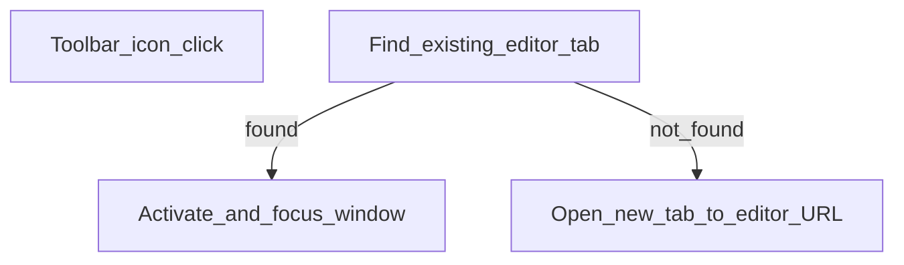

# Chrome extension

Small MV3 package under `extension/`. It only **opens or focuses** the live editor. It does not read other sites or your documents.

## Flow

## Details

- **Manifest:** `extension/manifest.json` — name *Bihar Police Notebook*, permission `tabs` only.
- **Worker:** `extension/background.js` — `ORIGIN` = `https://bpdiary.arverma.dev`.
- **Install:** Chrome → Developer mode → Load unpacked → select `extension/`.

For local preview, temporarily point `ORIGIN` / `BASE` at your local server, then reload the extension.

See also: [Deploy](deploy.md), [Architecture](../architecture.md).
