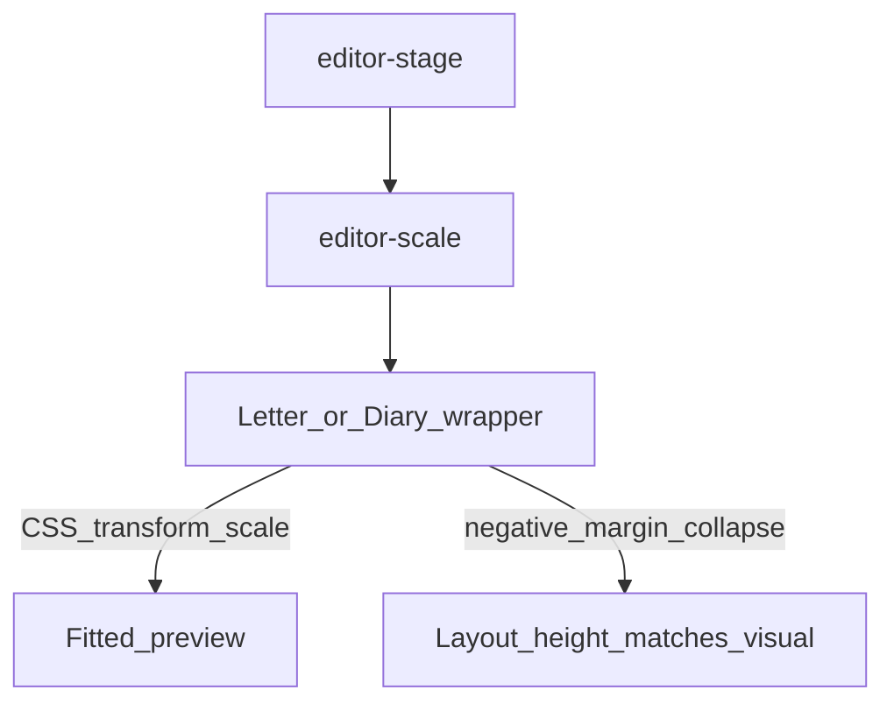

# Page preview (scale / pinch)

On-screen A4 pages are scaled to fit the window. **Print and pagination geometry stay full A4** — scale is preview-only (`editor/js/page-scale.js`, `editor/css/page-preview.css`).

## Concepts

| Mode | Behavior |
|------|----------|
| Desktop / tablet | Auto fit-to-width; no pinch UI |
| Mobile ≤768px | Pinch zoom, double-tap fit ↔ 100%, **Fit** chip when zoomed away from fit |
| Print | Transform disabled; real A4 |

Layout after scale uses a **negative margin** collapse (not a fixed clipped height), so multi-page diaries are not cut off mid-page.

See: [Templates](templates.md), [Editor shell](editor-shell.md).
