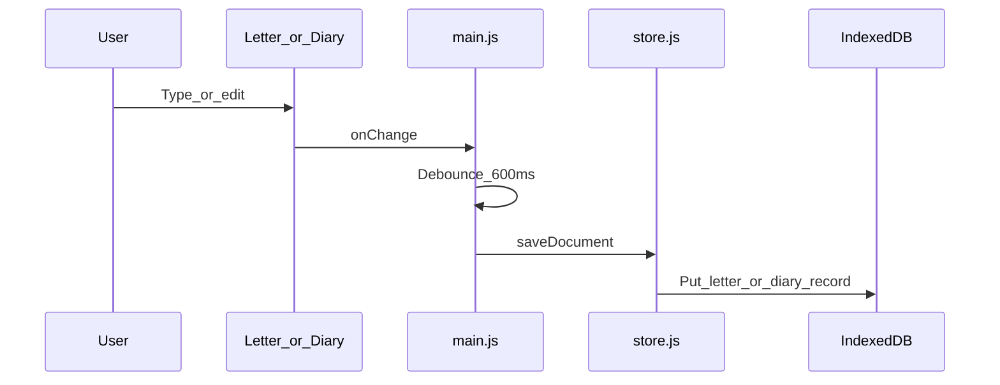

# Local storage (IndexedDB)

Documents autosave on the device that is running the editor. Database name: **`bp-writing-tool`** (`editor/js/store.js`).

## Save sequence

## Document fields (conceptually)

| Field | Meaning |
|-------|---------|
| `type` | `letter` or `diary` |
| `filename` | Display name (often a date) |
| `content` | Letter: text string. Diary: JSON `{ header, pages }` |
| `uuid` | Stable id used for Drive file matching |
| `driveFileId` / `syncedAt` / `syncError` | Backup metadata |
| `deletedAt` | Soft-delete (tombstone for Drive) |

History lists live documents for the **active** template only. Delete soft-deletes when a Drive copy may exist; otherwise hard-delete.

Prefs for UI/auth flags use `localStorage` via `prefs.js` (`bpnt.*` keys) — separate from document IndexedDB.

See: [Drive backup](drive-backup.md).
