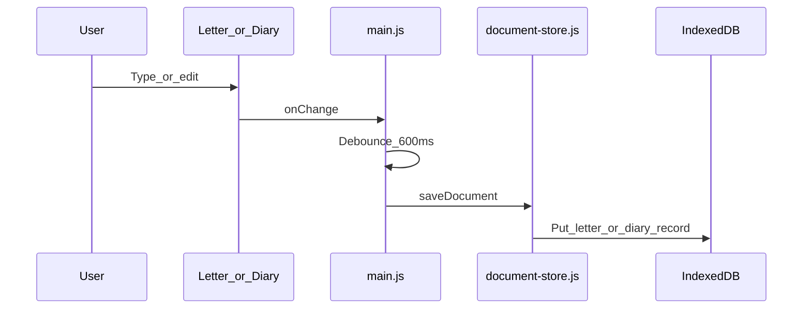

# Local storage (IndexedDB)

Documents autosave on the device that is running the editor. Database name: **`bp-writing-tool`** (`editor/js/document-store.js`).

## Save sequence

```mermaid
sequenceDiagram
  participant User
  participant Sheet as Letter_or_Diary
  participant Main as main.js
  participant Store as document-store.js
  participant IDB as IndexedDB

  User->>Sheet: Type_or_edit
  Sheet->>Main: onChange
  Main->>Main: Debounce_600ms
  Main->>Store: saveDocument
  Store->>IDB: Put_letter_or_diary_record
```

## Document fields (conceptually)

| Field | Meaning |
|-------|---------|
| `type` | `letter` or `diary` |
| `filename` | Display name (often a date) |
| `content` | JSON `{ format: "bp-doc", v: 1, doc }` — the editor document (pages, header fields, text). Other shapes are shown as **Older format** in History and can only be deleted. |
| `uuid` | Stable id used for Drive file matching |
| `driveFileId` / `syncedAt` / `syncError` | Backup metadata |
| `deletedAt` | Soft-delete (tombstone for Drive) |

History lists live documents for the **active** template only. Delete soft-deletes when a Drive copy may exist; otherwise hard-delete. Deleting an older-format document also clears its `content` in the tombstone, so no unusable payload stays on the device or in Drive.

Prefs for UI/auth flags use `localStorage` via `prefs.js` (`bpnt.*` keys) — separate from document IndexedDB.

See: [Drive backup](drive-backup.md).
