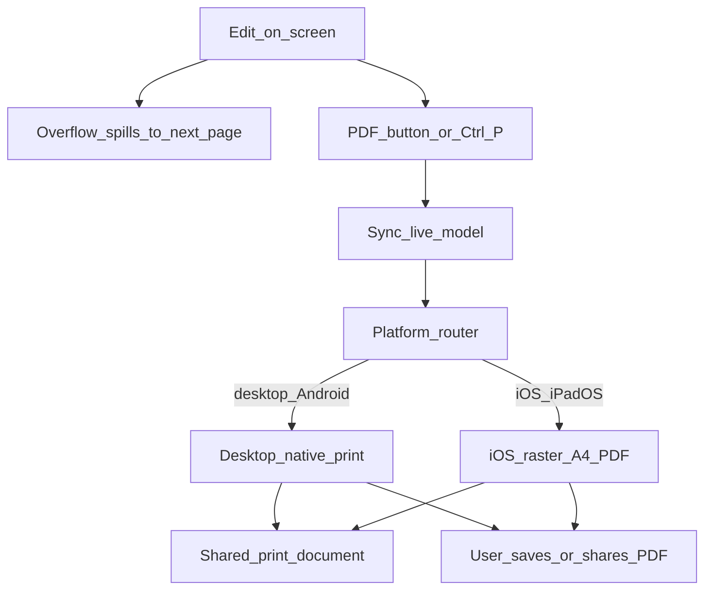

# Letter and Diary templates

Two print-ready A4 templates share the same shell. Switching templates starts a new document of that type (after saving the current one if needed).

| Template | Module | Content shape |
|----------|--------|-----------------|
| Letter | `editor/js/letter-sheet.js` | Plain text across page cards |
| Diary | `editor/js/diary-sheet.js` | FIR header + pages with left/right columns |

Rich text helpers for both templates live in `editor/js/quill-pages.js`.

## Edit → print / PDF flow

## Screen vs print

- **On screen:** pages may be scaled to fit the window ([Page preview](page-preview.md)). Scaling is visual only.
- **Shared print document:** both export backends use [`editor/js/export/print-document.js`](../../editor/js/export/print-document.js) (`buildPrintDocumentHtml` / `mountPrintDocument`) so line wrapping matches the editor.
- **Desktop / Android:** native browser print dialog from the hidden iframe (`triggerNativePrint`). Prefer **Save as PDF** with A4 and default margins.
- **iOS / iPadOS:** WebKit’s print pipeline clips full-bleed A4 cards, so export builds a raster A4 PDF ([`editor/js/export/raster-pdf.js`](../../editor/js/export/raster-pdf.js)) from the same print-document cards (html2canvas + jsPDF). Text in that PDF is not selectable; visual completeness is the goal. Verify on a real iPhone/iPad — desktop Playwright WebKit does not reproduce iOS Quartz print.
- **Delivery order (iOS):** generate the blob first, then Web Share sheet → download anchor → same-tab navigation. Never open a tab before generation: backgrounding the editor tab throttles rendering and stalls rasterization, which shows up as a permanently blank `about:blank` tab.

Routing lives in [`editor/js/export/router.js`](../../editor/js/export/router.js); the UI entry point is `handleDocumentExport()` in `editor/js/main.js`, which calls `runDocumentExport()`.

Diary extras: Hide/Show header per page, Add page, delete page. Letter uses continuous page spill when text overflows.

Diary body columns reflow locally on edit (spill forward when a box overflows — static cut then **live peel** until the real box fits; absorb backward by pulling one line / block / fitting in-paragraph text prefix at a time into slack, including when slack appears on an earlier page after Backspace). Opening a saved diary does **not** re-cut existing page slices. Trailing pages with no header and empty left+right bodies are collapsed after reflow, except the page the restored caret maps into (so Enter that spills a lone blank line keeps that next page). Reflow does not auto-scroll `main.main-content` — only the user scrolls. The left column stays a plain textarea.

**Session undo/redo** (Ctrl/Cmd+Z and Ctrl/Cmd+Shift+Z) is owned by the diary/letter sheet as a stack of fitted `pages[]` snapshots — not Quill’s per-instance History module. Continuous-right destroys the live Quill on page switch, and spill can rebuild the DOM; a document-level stack survives both. Undo is not persisted across reload; opening a document or `setModel` / `setText` clears the stack.

The caret is preserved across reflow as an offset into the column's joined content, so it must be measured in the same space the editor reports selections in: raw characters for the left textarea, Quill indices for the right column. Right-column pages are joined as block sequences, so each page junction costs one newline (`caretJunctionCost`) and every block break — including a trailing empty paragraph — costs an index. Plain-text length (`columnTextLength`) ignores block breaks and must not be used for caret math; use `caretColumnLength` / `caretToGlobal` / `caretFromGlobal`.

**Blank lines are content.** The live model stores right-column HTML via `getQuillHtmlPreservingBlanks` (a Quill that only holds the default trailing newline still stores `''`). That helper serializes from live `root.innerHTML` and runs `sanitizeQuillHtml`, which canonicalizes empty blocks as `
 
` (Quill’s `getSemanticHTML()` would emit bare `

`, which collapses outside live Quill and drops blanks on page switch / PDF). `isPageBodyEmpty` treats a lone empty `
` as empty Quill default, but extra blank paragraphs as occupied layout — so `collapseTrailingEmptyPages` can drop truly empty trailing pages; when a caret global offset maps onto a trailing blank page, callers pass that page as `keepIndex` so Enter-spill blanks survive. `splitRichToFit` treats spill as missing only when the cut covers the full document length, never when HTML serializes to `''` while delta remains. What you see on screen (including trailing Enters) is what print/PDF must show.

**Split against the live box, not the computed one.** Every `splitTextToFit` call passes `liveBoxFor(pageIndex, col)` for an initial cut, then `peelUntilLiveFits` removes trailing units until the live Quill/textarea accepts the keep (or `scrollTop` would go non-zero). Overflow is `scrollHeight > clientHeight + 1` **or** `scrollTop > 0`. Content that overflows and does not spill would otherwise scroll inside a fixed-height box and silently clip its top lines.

**Caret from the delta, not a delayed selection.** Quill emits `text-change` with the new content but the *previous* selection. Right-column reflow derives the caret with `caretIndexAfterTextChange` (stale index + insert length) and skips while `isComposing` or the Hinglish suggestions box owns the word; `compositionend` reflows once. Do not call `getSelection()` expecting the post-type caret inside `text-change`.

**Keeping the caret visible.** Three rules, each one a fixed bug:

- Diary right column uses one live Quill on the focused page; other pages show static HTML clones of `pages[].right`. Clicking a static host activates that page. Persistence remains `pages[]` only.
- Absorb pulls one plain line (left) or one top-level HTML block / fitting `P`/`DIV` text prefix (right) at a time into the previous page while it fits — including pulling from page 2 into page 1 when page 1 gains slack. Boundary Backspace tries absorb-first, then delete-on-prev. A live overflow re-check after apply pushes any leftover clip forward.
- `restoreCaretGlobal` uses `setSelection(index, 0, 'api')` and never `quill.focus()` first — `focus()` restores the range reflow just invalidated. Caret restore must **not** auto-scroll the stage: `restoreCaretGlobal` uses `focus({ preventScroll: true })` / Quill `setSelection(..., 'api')` with `scrollSelectionIntoView` no-op'd, and reflow freezes `main.main-content` (or `#editorStage` on mobile) scroll across render. Only wheel/trackpad/scrollbar move the stage.

**Justify caret:** Diary right-column Quill sets selection from `caretRangeFromPoint` on mousedown inside `ql-align-justify` blocks, after mapping the click through `--page-scale` (`scaledClientToLayoutPoint`). Do not disable justify for print.

Manual regression checklist: [Diary pagination manual tests](../manual-tests/diary-pagination.md).
