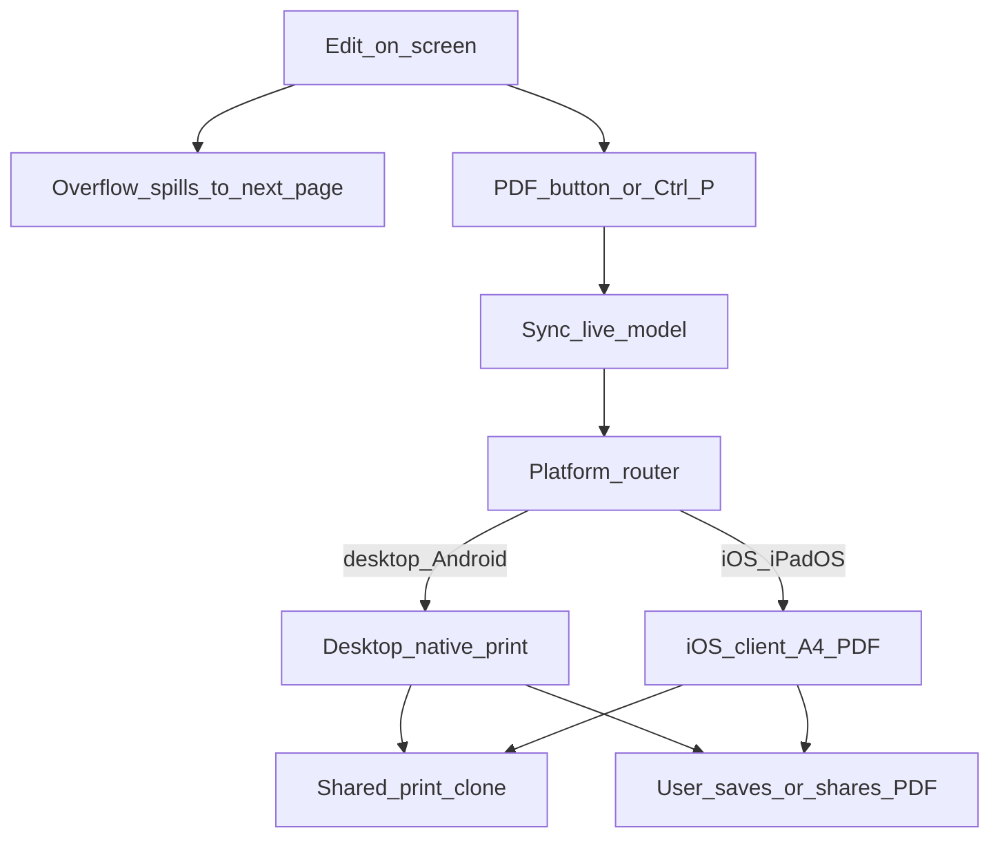

# Letter and Diary templates

Two print-ready A4 templates share the same shell. Switching templates starts a new document of that type (after saving the current one if needed).

| Template | Module | Content shape |
|----------|--------|-----------------|
| Letter | `editor/js/paged-sheet.js` | Plain text across page cards |
| Diary | `editor/js/diary-sheet.js` | FIR header + pages with left/right columns |

## Edit → print / PDF flow

## Screen vs print

- **On screen:** pages may be scaled to fit the window ([Page preview](page-preview.md)). Scaling is visual only.
- **Shared clone:** both export backends use [`editor/js/print-clone.js`](../../editor/js/print-clone.js) (`buildPrintCloneBody` / `mountPrintCloneIframe`) so line wrapping matches the editor.
- **Desktop / Android:** native browser print dialog from the hidden iframe (`openPrintCloneWindow`). Prefer **Save as PDF** with A4 and default margins.
- **iOS / iPadOS:** WebKit’s print pipeline clips full-bleed A4 cards, so export builds a client-side A4 PDF ([`editor/js/client-pdf.js`](../../editor/js/client-pdf.js)) from the same clone cards (raster pages via vendored html2canvas + jsPDF). Text in that PDF is not selectable; visual completeness is the goal. Verify on a real iPhone/iPad — desktop Playwright WebKit does not reproduce iOS Quartz print.
- **Delivery order (iOS):** generate the blob first, then Web Share sheet → download anchor → same-tab navigation. Never open a tab before generation: backgrounding the editor tab throttles rendering and stalls rasterization, which shows up as a permanently blank `about:blank` tab.

Routing lives in [`editor/js/pdf-export.js`](../../editor/js/pdf-export.js); orchestration still starts at `runPdfExport()` in `editor/js/main.js`.

Deprecated rebuild helpers (`diaryPagesHtml` / `letterPagesHtml` and matching print CSS) remain in the sheet modules for rollback only; export no longer calls them.

Diary extras: Hide/Show header per page, Add page, delete page. Letter uses continuous page spill when text overflows.
