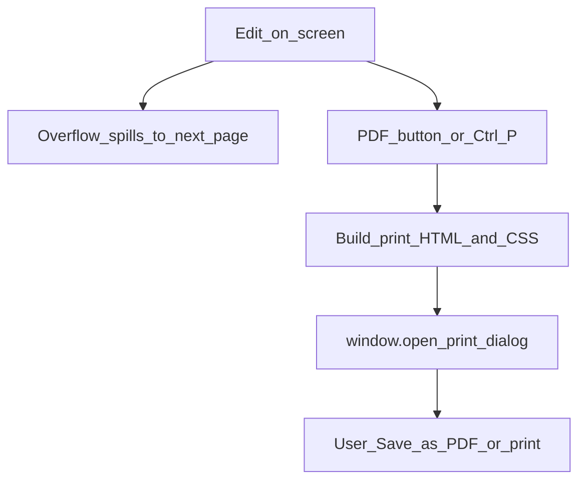

# Letter and Diary templates

Two print-ready A4 templates share the same shell. Switching templates starts a new document of that type (after saving the current one if needed).

| Template | Module | Content shape |
|----------|--------|-----------------|
| Letter | `editor/js/paged-sheet.js` | Plain text across page cards |
| Diary | `editor/js/diary-sheet.js` | FIR header + pages with left/right columns |

## Edit → print flow

## Screen vs print

- **On screen:** pages may be scaled to fit the window ([Page preview](page-preview.md)). Scaling is visual only.
- **Print / PDF:** unscaled A4 geometry from `letterPagesHtml` / `diaryPagesHtml` and matching print CSS.

Diary extras: Hide/Show header per page, Add page, delete page. Letter uses continuous page spill when text overflows.

Orchestration for export: `runPdfExport()` in `editor/js/main.js`.
