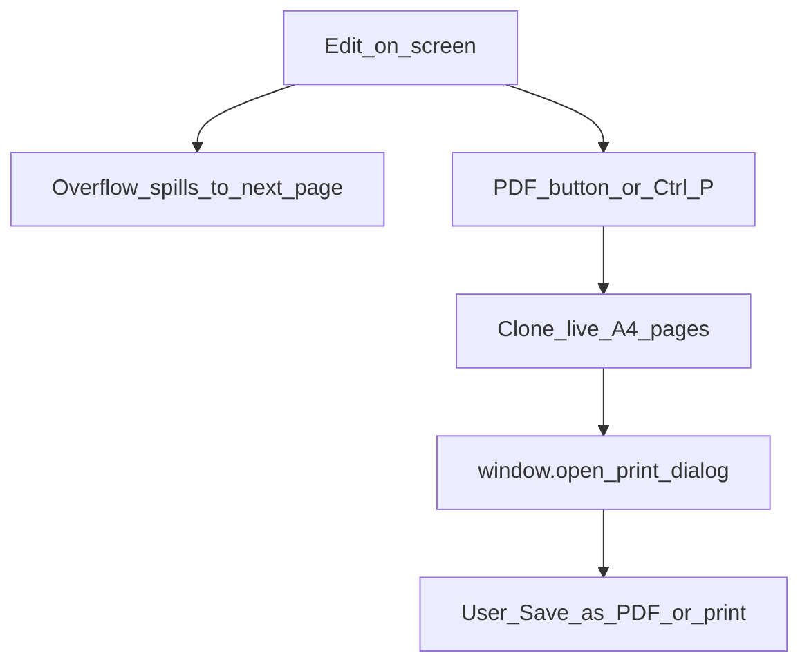

# Letter and Diary templates

Two print-ready A4 templates share the same shell. Switching templates starts a new document of that type (after saving the current one if needed).

| Template | Module | Content shape |
|----------|--------|-----------------|
| Letter | `editor/js/paged-sheet.js` | Plain text across page cards |
| Diary | `editor/js/diary-sheet.js` | FIR header + pages with left/right columns |

## Edit → print flow

## Screen vs print

- **On screen:** pages may be scaled to fit the window ([Page preview](page-preview.md)). Scaling is visual only.
- **Print / PDF:** `runPdfExport()` clones the live `.diary-page` / `.letter-page` cards via [`editor/js/print-clone.js`](../../editor/js/print-clone.js), strips screen chrome, and prints them with the same editor CSS (unscaled A4). Line wrapping therefore matches what you see while writing.

Deprecated rebuild helpers (`diaryPagesHtml` / `letterPagesHtml` and matching print CSS) remain in the sheet modules for rollback only; export no longer calls them.

Diary extras: Hide/Show header per page, Add page, delete page. Letter uses continuous page spill when text overflows.

Orchestration for export: `runPdfExport()` in `editor/js/main.js`.
