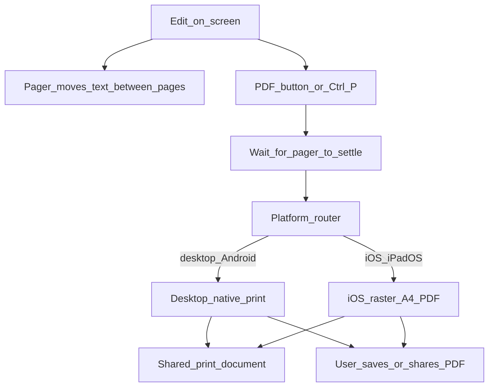

# Letter and Diary templates

Two print-ready A4 templates share the same shell. Switching templates starts a new document of that type (after saving the current one if needed).

On load the app reopens the document that was open last. If it no longer exists or cannot be opened, it opens the top of that template's History (the newest document this version can open); it starts a new document only when History has nothing to open (`editor/js/startup-document.js`).

| Template | Module | Document |
|----------|--------|----------|
| Letter | `editor/js/letter-sheet.js` | `letterPage+` — one writing box per page |
| Diary | `editor/js/diary-sheet.js` | `diaryPage+` — form header + left/right writing boxes per page |

Both are one rich-text editor per document, built on Tiptap / ProseMirror (`editor/js/editor/`). The library is vendored as a single ES module (`editor/vendor/tiptap/tiptap.esm.js`, built by `npm run vendor:tiptap`); app code imports it only through `editor/js/editor/tiptap.js`.

## Edit → print / PDF flow


```mermaid
flowchart TD
  edit[Edit_on_screen]
  spill[Pager_moves_text_between_pages]
  pdfBtn[PDF_button_or_Ctrl_P]
  sync[Wait_for_pager_to_settle]
  route[Platform_router]
  clone[Shared_print_document]
  native[Desktop_native_print]
  raster[iOS_raster_A4_PDF]
  save[User_saves_or_shares_PDF]

  edit --> spill
  edit --> pdfBtn
  pdfBtn --> sync
  sync --> route
  route -->|desktop_Android| native
  route -->|iOS_iPadOS| raster
  native --> clone
  raster --> clone
  native --> save
  raster --> save
```

## Screen vs print

- **On screen:** pages may be scaled to fit the window ([Page preview](page-preview.md)). Scaling is visual only. Each page shows a screen-only "Page X of Y" footer; diary pages also have screen-only chrome (Hide/Show header, delete page). None of it prints.
- **Shared print document:** both export backends use [`editor/js/export/print-document.js`](../../editor/js/export/print-document.js) (`buildPrintDocumentHtml` / `mountPrintDocument`). It clones the live pages and loads the same stylesheets (`editor.css` + `doc-editor.css`), so every line breaks where it does on screen. Text layout (`white-space`, ligatures) lives on `.bp-cell`, not on the editor root, because the clone does not include the root.
- **Desktop / Android:** native browser print dialog from the hidden iframe (`triggerNativePrint`). Prefer **Save as PDF** with A4 and default margins.
- **iOS / iPadOS:** WebKit’s print pipeline clips full-bleed A4 cards, so export builds a raster A4 PDF ([`editor/js/export/raster-pdf.js`](../../editor/js/export/raster-pdf.js)) from the same print-document cards (html2canvas + jsPDF). Text in that PDF is not selectable; visual completeness is the goal. Verify on a real iPhone/iPad — desktop Playwright WebKit does not reproduce iOS Quartz print.
- **Delivery order (iOS):** generate the blob first, then Web Share sheet → download anchor → same-tab navigation. Never open a tab before generation: backgrounding the editor tab throttles rendering and stalls rasterization, which shows up as a permanently blank `about:blank` tab.

Routing lives in [`editor/js/export/router.js`](../../editor/js/export/router.js); the UI entry point is `handleDocumentExport()` in `editor/js/main.js`, which waits for pagination to settle and calls `runDocumentExport()`.

## Document model

```
letter doc = letterPage+        letterPage = flowCell[col=main]
diary doc  = diaryPage+         diaryPage  = flowCell[col=left] flowCell[col=right]
                                             attrs { hasHeader, fields }
flowCell   = (paragraph | orderedList | bulletList | image)+
```

- A **flowCell** is one fixed-height writing box. Both diary columns are rich text (bold, italic, underline, alignment, lists) and flow across pages independently.
- The **diary header** (case-diary number, थाना, जिला, FIR, dates, धारा, अन्वेषण का अभिलेख …) is stored as page attributes and edited through native inputs in the page's node view (`editor/js/editor/page-views.js`). Header edits are transactions, so they autosave and undo like body text; a burst of typing in one field is one undo step.
- **`cont`** on a paragraph or list marks the tail of a block the pager cut at a page edge: "this continues the last block of the previous page's cell in this column". Only continuations are ever re-joined, so moving a page boundary can never weld two separate paragraphs together. A numbered list cut across pages continues its numbering (`start`).
- New pages created by the pager have no header. A page whose header the user switched on is kept even when empty.

Saved content is `{ "format": "bp-doc", "v": 1, "doc": … }` (`editor/js/editor/doc-format.js`). Content in any other shape is shown in History as **Older format**; opening it offers to delete it (`editor/js/unsupported-docs.js`) instead of mounting the editor.

## Pagination

The pager (`editor/js/editor/pager/`) runs after the DOM reflects each change (plugin view update, then one animation frame) and loops measure → dispatch → measure until every box fits:

- **Spill:** when a cell's last block crosses the bottom of its box, the content from the first line that doesn't fit moves to the same column on the next page (created if needed). A paragraph is cut at the start of a rendered line found with `coordsAtPos`, so the browser's own line breaking decides the cut; it is snapped to a grapheme boundary so Devanagari clusters are never split. Lists are cut between items; an image is never cut (CSS caps it at one box).
- **Absorb:** when a cell has at least one free line, the next page's first block in that column moves up — a continuation re-joins its head, a separate paragraph moves as a paragraph — and spill re-cuts it at a real line. A pass that would only undo itself stops absorbing that cell.
- **Opening a document** repairs overflow but never absorbs: a stored layout opens exactly as saved, and text is pulled back only after an edit near it.
- Empty trailing pages are dropped, except the page holding the caret (so Enter that spills a lone blank line keeps that page).
- **Measurement** compares viewport rects only (`getBoundingClientRect`, `coordsAtPos`), scaling layout pixels by the cell's own `rect.height / offsetHeight`, so it is exact under `--page-scale`. Cells use `overflow: clip` and cannot scroll.
- **Suspension:** the pager waits while the IME is composing (Android keyboards compose most words), while a mouse button is down, and while the Hinglish suggestion box owns the word. The cell being typed in shows overflow meanwhile (`[data-bp-suspended]`).
- **Caret:** moving text is a delete + insert, so the pager remaps the selection explicitly onto the moved characters; `mapThroughPager` does the same for any position a caller holds across a reflow. The pager never scrolls the stage (`handleScrollToSelection`), only the user does.

Writing-box height comes from the live header height, snapped to whole 24px lines (`editor/js/editor/diary-geometry.js`), and is set as `--diary-box-h` on the page's own node-view element.

## Undo / redo

One history per document (ProseMirror history, depth 100). A pager transaction that follows an edit is merged into that edit's undo step, so one Ctrl/Cmd+Z restores both the text and the page layout it had. Opening a document starts a fresh history. Ctrl/Cmd+Z in a header input undoes the document too (`main.js` routes the shortcut).

## Selection and keys at page edges

- A selection covers one page's cell at most (`editor/js/editor/structure.js`); Ctrl/Cmd+A selects the current cell. Every edit therefore stays inside one cell and can never merge pages or columns; a transaction that would is dropped.
- At a cell edge, Backspace / Delete / arrow keys continue in the same column on the neighbouring page, as in one continuous column: Backspace at the top of page 2 deletes the character before a cut, or joins a separate paragraph onto page 1's last one. Android Backspace (keyCode 229) is handled through `beforeinput`.

## Transliteration and dictation

`editor/js/editor/text-field.js` gives `main.js` an input-like view of the editor: the current paragraph's text, the caret offset in it, and `replaceRange` (which keeps the surrounding marks). Header fields are plain inputs and keep their own listeners; events bubbling from them to the editor root are ignored by the body-text handlers.

## Tests

- Unit (`npm test`): schema-level pager operations, structure guard and page-edge keys, saved format, geometry, text-field adapter, print sanitizing.
- End to end (`make test-e2e`, and `npm run test:webkit` for Safari's engine): `tests/diary-pagination.spec.js`, `diary-navigation`, `diary-undo`, `print-parity`, `editor-spaces`, `ime-composition`, `unsupported-docs`, transliteration and dictation specs. Tests read state through `window.__bpTest` (`editor/js/editor/test-hooks.js`) and wait with `__bpTest.settle()`; pages and cells carry `data-page-no` / `data-page-count` / `data-col` / `data-overflow`, and the editor root carries `data-bp-pager="idle|pending|suspended"`.

Manual regression checklist: [Diary pagination manual tests](../manual-tests/diary-pagination.md).
