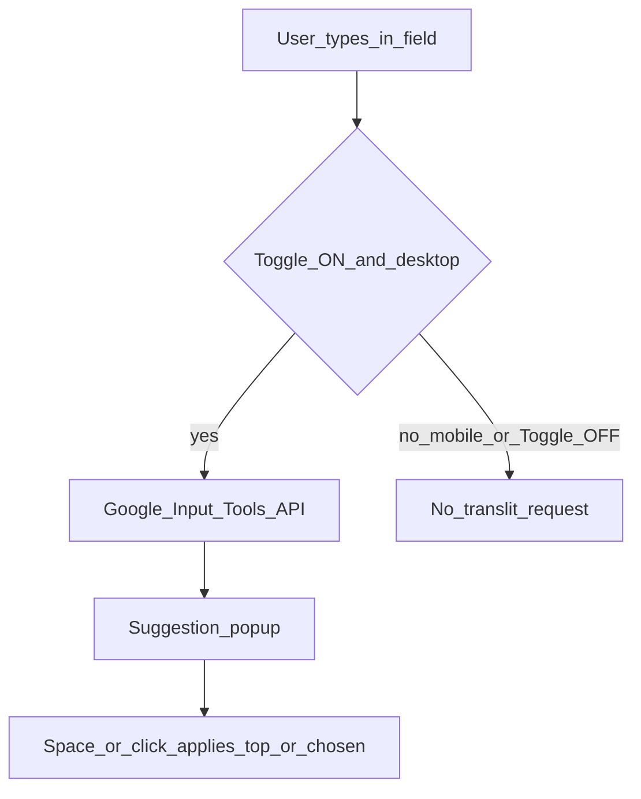

# Hindi Typing (Transliteration)

On desktop and tablet, turning the **Hindi Typing toggle (A:अ)** ON sends the current word to Google Input Tools and shows Devanagari suggestions. When the toggle is OFF, you type standard English (no suggestion network call).

Implementation: `editor/js/translit.js`, wired from `main.js`.

## Flow

## Rules

- **≤768px:** The transliteration toggle is hidden; `isTransliterationEnabled()` is false — use the OS keyboard (including its mic if needed).
- Suggestions require internet; typing without suggestions (toggle OFF) still works offline.
- Only the specific word typed for suggestions is sent — not the full saved document history.

See: [Desktop vs mobile](../desktop-vs-mobile.md), [Dictation](dictation.md).
