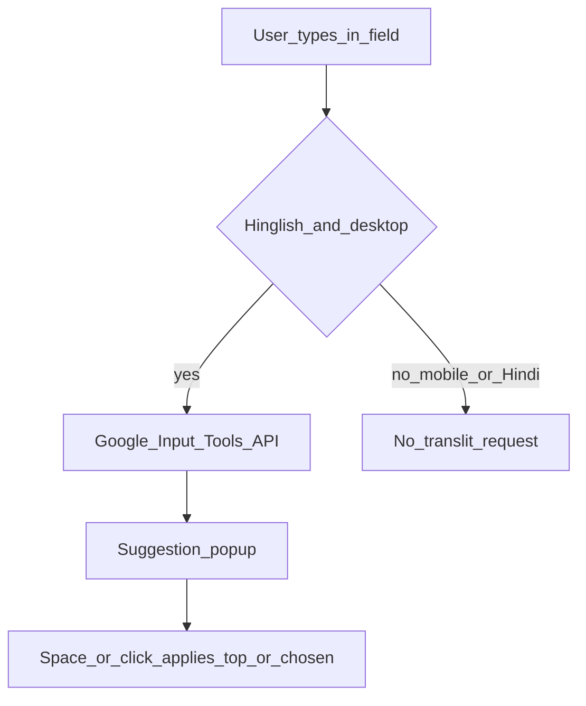

# Hinglish typing (transliteration)

On desktop and tablet, **Hinglish** mode sends the current word to Google Input Tools and shows Devanagari suggestions. **Hindi** mode types Devanagari directly (no suggestion network call for transliteration).

Implementation: `editor/js/translit.js`, wired from `main.js`.

## Flow

## Rules

- **≤768px:** Hinglish/Hindi segment is hidden; `isTransliterationEnabled()` is false — use the OS keyboard (including its mic if needed).
- Suggestions require internet; typing without suggestions still works offline.
- Only the text used for suggestions is sent — not the full saved document history.

See: [Desktop vs mobile](../desktop-vs-mobile.md), [Dictation](dictation.md).
