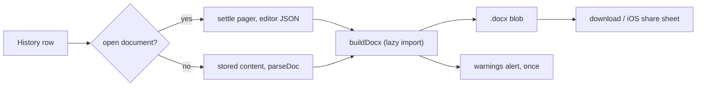

# Word (.docx) export

Each row in History has a Word button. It downloads the document as an **editable** Word file — not a pixel copy of the print layout (that is what PDF is for).

| Piece | File |
|-------|------|
| Button, per-row handler | `editor/js/main.js` (`exportHistoryDocx`) |
| Run + download + warnings | `editor/js/export/docx-export.js` |
| Exporter (doc JSON → `.docx`) | `editor/js/export/docx/` |
| `docx` library, vendored | `editor/vendor/docx/docx.esm.js` (`npm run vendor:docx`) |

## Flow



- The open document is exported from the live editor (it can be ahead of its last autosave); any other row from its stored copy **without opening it**.
- A blank document is refused with "Cannot export empty document!" (`docHasContent`, shared with autosave's "meaningful content" check).
- The exporter is a **pure function of the document JSON** — no DOM — so it is unit-tested directly. It and the ~400 KB `docx` bundle load only on the first export.

## Decisions

| Question | Decision | Why |
|----------|----------|-----|
| Purpose | Editable copy | Fidelity to the print layout would make the Word file hard to edit and still drift between Word and LibreOffice |
| Page breaks | The pager's cuts are dropped; Word paginates on A4 with the editor's 12.7 mm margins | The cuts are positions in *our* layout, not the author's |
| `cont` pieces | Re-joined (`merge-cont.js`), letter fully | Only `cont` blocks are joined; separate paragraphs never are |
| Diary header | A bordered table in the body, with a page break before every header page after the first | The header belongs to one page, which a Word section header cannot express |
| Diary body | One bordered 20 % / 80 % table, **one row per editor page** | Keeps left notes beside the right-column text they were written with |
| Ruled lines | Dropped | CSS-only; no Word equivalent that stays aligned with text |
| Fonts | Noto Sans Devanagari named on ascii/hAnsi/cs/eastAsia; bold/italic/size set for both Latin and complex-script properties; not embedded | Word falls back to a Devanagari font when it is missing; embedding adds hundreds of KB per file |
| Images | Saved width % of the cell, aspect ratio read from the PNG/JPEG header | Matches resize in the editor; no DOM needed |
| Unmappable content | Plain-text fallback + a `warnings` list; the export never throws on a valid document | One cosmetic edge case should not block the export |

## Mapping

| Editor | Word |
|--------|------|
| paragraph, `textAlign` | paragraph, alignment (justify → both) |
| bold / italic / underline | run properties (`b`+`bCs`, `i`+`iCs`, `u`) |
| `hardBreak` | line break |
| bullet / ordered list | numbering; an ordered list keeps its `start` |
| table | table; header row repeats on each Word page; `colspan`/`rowspan`/`colwidth` kept |
| image | inline picture with alt text |
| diary header + titles row | bordered tables (Hindi labels as in the form) |

## Known limits

- A diary paragraph the pager cut at a page edge stays in its own page's row, so it appears as two paragraphs at that row boundary (a letter's pieces are re-joined). Stitching the tail into the earlier row is possible if this matters.
- No ruled lines, no screen-only chrome, no page footer ("Page X of Y").
- Word's page count can differ from the editor's.
- The rule number is the form's fixed "(नियम-164)".

## Adding a node type

1. Map it in `blocks.js` / `inline.js` / `pages.js` and add its name to that module's exported type list (`BLOCK_TYPES`, `INLINE_TYPES`, `PAGE_TYPES`).
2. `docx.test.js` → "maps every node type in both schemas explicitly" fails until you do — that is the point.

## Updating the library

```bash
npm install --save-exact docx@<version>
npm run vendor:docx
```

CI runs `npm run vendor:docx -- --check` and fails if the committed bundle does not match the pinned version.

## Tests

- Vitest: `editor/js/export/docx/docx.test.js` (unzips the output and asserts on `document.xml`), `editor/js/export/docx-export.test.js`, `docHasContent` in `editor/js/editor/doc-format.test.js`.
- Playwright: `tests/docx-export.spec.js` (open row, other row, always-visible actions, History header).
- Manual, in real Word: [Word export checklist](../manual-tests/word-export.md). The automated tests check the XML, not how Word renders it.
