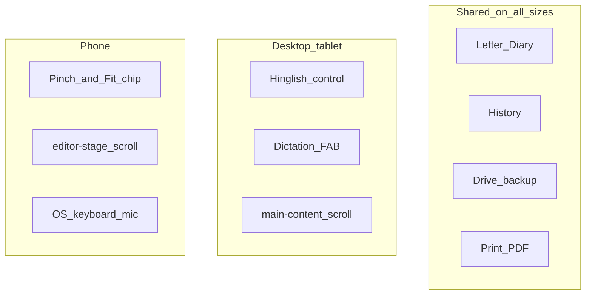

# Desktop vs mobile

Canonical breakpoint: **`max-width: 768px`** (phone layout). Wider viewports use desktop/tablet behavior. Extra header tightening uses 1100 / 900 / 420px; History nudge uses ≥1025px.

## Feature matrix

| Capability | Desktop / tablet | Phone (≤768px) |
|------------|------------------|----------------|
| Letter & Diary templates | Yes | Yes |
| Document History | Yes (sidebar; slight workspace nudge on very wide screens) | Yes (overlay drawer) |
| Google Drive backup | Yes | Yes |
| Print / Save as PDF | Yes | Yes |
| Document name in header | Yes | Yes |
| Hinglish ↔ Hindi control | Yes | Hidden |
| Transliteration suggestions | Yes (Hinglish mode) | Off — type with keyboard / OS tools |
| In-app dictation microphone | Yes (draggable FAB) | Hidden — use keyboard mic |
| Page fit-to-width | Automatic | Automatic + pinch, double-tap, Fit chip |
| Vertical scrolling | `.main-content` | `#editorStage` |
| Help (`?`) | Yes | Yes |

## Why these differences

- **Phones already expose a keyboard microphone** — the in-app FAB would duplicate it and crowd the page.
- **Hinglish suggestions need a stable popup UX** — on narrow screens the app relies on the system keyboard instead.
- **Pinch-zoom** is natural on touch; desktop mostly needs fit-to-width.
- **Scrollport split** avoids nested scroll traps (wheel on the page must reach the right container).

## Related code

- Header / lang hide: `editor/css/header-responsive.css`
- Dictation hide: `editor/js/dictation-ui.js`, `editor/css/overlays-responsive.css`
- Translit gate: `isTransliterationEnabled()` in `editor/js/main.js`
- Scale / pinch: `editor/js/page-scale.js`, `editor/css/page-preview.css`
- Shell scroll: `editor/css/layout-shell.css`, `page-preview.css`

See: [Architecture](architecture.md), [Editor shell](components/editor-shell.md), [Page preview](components/page-preview.md).
